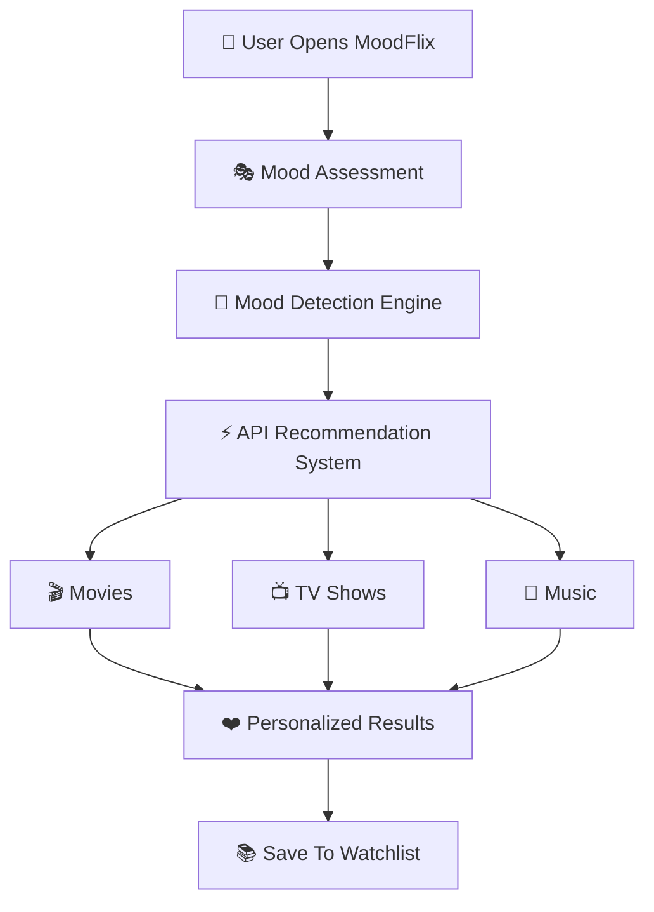

<div align="center">

# 🎬 MoodFlix


<br>


<br><br>


<br><br>

### 🌐 Live Demo

## 🔗 [Experience MoodFlix](https://movie-flix-a6cff.web.app)

<br>


</div>

---

# ✨ Overview

🎭 **MoodFlix** is a next-generation AI-inspired entertainment discovery platform designed to eliminate endless scrolling and instantly recommend:

- 🎬 Movies
- 📺 TV Shows
- 🎵 Music

based on the user’s **current emotional state**.

Using an interactive mood assessment engine, MoodFlix intelligently curates personalized entertainment experiences tailored to how users feel in real-time.

---

# 🧠 Core Idea

> “Entertainment should match emotions, not algorithms.”

MoodFlix transforms entertainment discovery into a personalized emotional journey.

Whether you're:
- 😊 Happy
- 😢 Emotional
- 😌 Relaxed
- 💕 Romantic
- 🔥 Thrill-Seeking
- 🎯 Focused

MoodFlix finds the perfect vibe instantly.

---

# 🎭 Mood Categories

<div align="center">

| Mood | Experience |
|------|------|
| 😊 Happy | Feel-good movies & uplifting music |
| 😢 Sad | Emotional stories & healing tracks |
| 😌 Chill | Relaxing visuals & calm playlists |
| 💕 Romantic | Love stories & romantic vibes |
| 🔥 Thriller | Suspenseful & adrenaline-filled content |
| 🎯 Focused | Productivity-friendly recommendations |

</div>

---

# 🎬 Platform Experience

## 🏠 Cinematic Homepage

MoodFlix offers a premium cinematic landing experience with:

✨ Interactive Hero Section  
✨ Animated Mood Cards  
✨ Trending Entertainment Showcase  
✨ Dynamic Movie Walls  
✨ Song Preview Sections  
✨ Smooth Scroll Animations  
✨ Glassmorphism UI  
✨ Responsive Design  

---

# 🔥 Features

## 🎭 AI-Inspired Mood Detection

Interactive emotional assessment system that understands:
- Current Mood
- Energy Level
- Viewing Preferences
- Language Choices
- Entertainment Interests

---

## 🎬 Movie Recommendations

Powered by **TMDB API**

✔ Trending Movies  
✔ Popular Titles  
✔ Genre Filtering  
✔ Mood-Based Discovery  
✔ Dynamic Posters  

---

## 📺 TV Show Discovery

Find series matching your vibe:

- Drama
- Romance
- Comedy
- Thriller
- Documentary
- Sci-Fi

---

## 🎵 Music Discovery

Powered using music APIs.

✔ Mood-Based Songs  
✔ Artist Discovery  
✔ Preview Playback  
✔ Curated Recommendations  

---

## ❤️ Personalized Watchlist

Save favorite content effortlessly.

Features:
- Watch Later
- Favorite Collections
- Personal Library
- Firebase Storage

---

## 🔐 Authentication System

Powered by Firebase Authentication.

Supports:
- Login
- Signup
- Session Handling
- User Profiles

---

# 🎨 UI / UX Design

<div align="center">

## 🌌 Design Philosophy

Minimal • Cinematic • Elegant • Interactive • Immersive

</div>

---

## ✨ UI Effects

- 🌫 Glassmorphism
- 💫 Blur Layers
- ⚡ Hover Animations
- 🌈 Gradient Accents
- 🎬 Cinematic Layouts
- 🔥 Smooth Reveal Effects
- 🎵 Dynamic Cards

---

## 🔤 Typography

```css
Playfair Display
DM Sans
Space Mono
````

---

# ⚡ Tech Stack

<div align="center">

| Frontend      | Backend        | APIs        | Hosting  |
| ------------- | -------------- | ----------- | -------- |
| HTML5         | Firebase Auth  | TMDB API    | Firebase |
| CSS3          | Firestore      | OMDB API    | Hosting  |
| JavaScript    | Firebase DB    | Last.fm API | Cloud    |
| Responsive UI | Authentication | Deezer API  | CDN      |

</div>

---

# 🏗️ Project Structure

```bash
MoodFlix
│
├── index.html
├── explore.html
├── try-now.html
├── account.html
│
├── css/
│   ├── main.css
│   ├── home.css
│   ├── explore.css
│   ├── try-now.css
│   └── account.css
│
├── js/
│   ├── config.js
│   ├── firebase-config.js
│   ├── auth.js
│   ├── db.js
│   ├── tmdb.js
│   ├── omdb.js
│   ├── music.js
│   ├── quiz.js
│   ├── recommender.js
│   └── main.js
│
└── assets/
```

---

# 🔄 Recommendation Workflow

<div align="center">



</div>

---

# 📱 Fully Responsive

MoodFlix is optimized for:

✅ Desktop
✅ Laptop
✅ Tablet
✅ Mobile Devices

Delivering a seamless experience across all screen sizes.

---

# 🚀 Future Enhancements

## 🤖 AI Chat Assistant

Conversational entertainment recommendations.

---

## 🎤 Voice Mood Detection

Analyze mood through voice interactions.

---

## 🎧 Spotify Integration

Real Spotify playback integration.

---

## 📊 Mood Analytics

Track entertainment trends over time.

---

## 🔔 Smart Notifications

Personalized recommendation alerts.

---

## 📱 Progressive Web App

Offline support + native app experience.

---

## 🌐 Multi-Language Support

Expanded language recommendations globally.

---

# 📸 Preview

<div align="center">

## 🎬 MoodFlix Experience


<br><br>


<br><br>


</div>

---

# 🌍 Live Website

<div align="center">

# 🔗 https://movie-flix-a6cff.web.app/

</div>

---

# 👨‍💻 Developer

<div align="center">


# Ayush Tripathi

### Frontend Developer • UI Engineer • AI Enthusiast

Passionate about building immersive digital experiences through:

* Modern UI/UX
* Interactive Interfaces
* AI-Powered Applications
* Performance-Driven Frontend Engineering

---

## ⚡ Skills

HTML5 • CSS3 • JavaScript • Firebase

UI/UX Design • API Integration • Responsive Design

Frontend Engineering • Performance Optimization

---

## 🌐 Connect With Me

<a href="https://github.com/yourusername">

</a>

<a href="https://linkedin.com/in/yourprofile">

</a>

<a href="https://twitter.com/yourprofile">

</a>

</div>

---

# 💡 Vision

<div align="center">

## 🎭 “Entertainment should understand emotions.”

MoodFlix was built to transform entertainment discovery into a deeply personalized emotional experience.

Instead of endlessly searching for what to watch or listen to, users simply express how they feel — and MoodFlix handles the rest.

</div>

---

# ⭐ Support

If you enjoyed this project:

🌟 Star the repository
🍴 Fork the project
🛠 Contribute improvements
📢 Share with others

---

<div align="center">

# 🎬 MoodFlix

## Stop Scrolling. Start Feeling.

Built with ❤️ using

HTML • CSS • JavaScript • Firebase • TMDB • OMDB • Last.fm • Deezer

<br>


</div>

